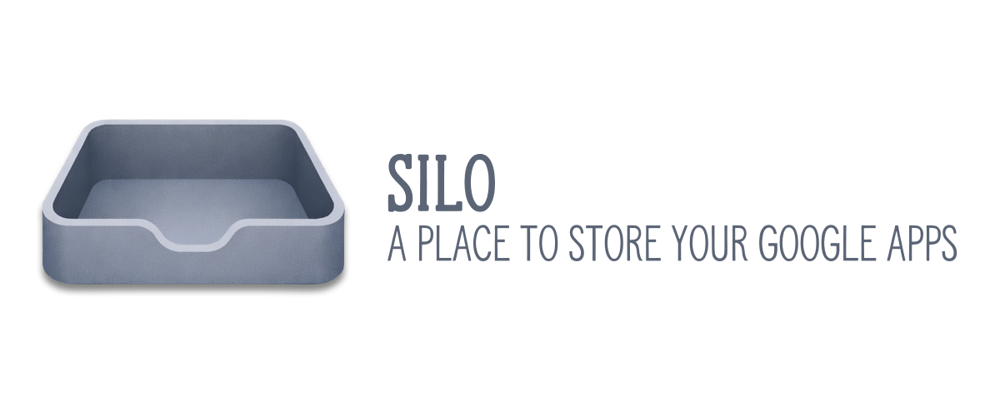

# Silo

<p align="center">
  
</p>

Silo is a lightweight Electron desktop app that brings Google Workspace tools into a focused, native-feeling experience on macOS.

It is not trying to replace your browser. It is trying to reduce friction.

Silo keeps Gmail, Calendar, Drive, Keep, Tasks, Contacts, and Gemini one click away in a single app, with fast switching, a minimal sidebar, and sane defaults that stay out of your way.

This started as a personal project to scratch an itch and learn more about Electron. It may eventually become something more.

## What Silo Is

Silo is:

- A macOS desktop wrapper for Google Workspace and Gemini
- Built with Electron
- Focused on speed, simplicity, and keyboard-friendly workflows
- Opinionated about UI, but intentionally limited in scope

It uses BrowserViews instead of tabs, so each Google app feels persistent rather than disposable.

## What Silo Is Not

Silo is not:

- A full Google Workspace client
- A replacement for native Google apps
- A polished, supported commercial product (yet)

Think of it as a sharp tool, not a Swiss Army knife.

## Features

- Quick switching between Gmail, Calendar, Drive, Keep, Tasks, Contacts, and Gemini
- Minimal sidebar with Material-style icons and custom icons where needed
- Native macOS menus and keyboard shortcuts
- Separate persistent views for each app
- Custom settings panel
- No tracking, no analytics, no account meddling

## Tech Stack

- Electron
- Node.js
- HTML, CSS, vanilla JavaScript
- Material Symbols plus custom icons

No frameworks were harmed in the making of this app.

## Development Setup

Clone the repo and install dependencies:

```
git clone https://github.com/your-username/silo.git
cd silo
npm install
```

Run the app in development mode:

```
npm start
```

Build steps and packaging are still evolving and may change.

## Platform Support

Currently tested on:

- macOS

Other platforms may work, but are not actively supported or tested.

## Status

This project is actively evolving and still rough around the edges. Expect:

- Incomplete features
- UI tweaks
- Breaking changes
- Occasional questionable decisions made late at night

That said, it is already useful in daily work.

## Contributing

Contributions are welcome, but expectations are intentionally modest.

If you want to contribute:

- Open an issue first to discuss ideas
- Keep changes focused and small
- Prefer clarity over cleverness

This project values maintainability and restraint.

## License

MIT License. Do what you want, just do not be weird about it.
